# Introduction

You probably use a bank application in your every day life and you wonder how they work. Every credit and debit transaction you make is stored as an event in a data store. This event data store is the source of truth and the current state of your account is computed from all events stored in the datastore. This is known as event sourcing.

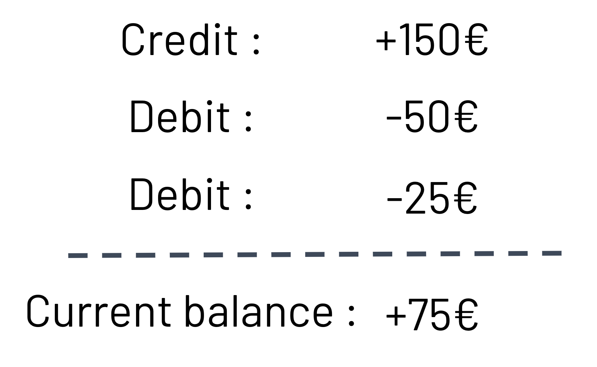

Numerous applications need to store a trace of all events to use the history or even for legal purposes such as a bank. If you share this need and you're thinking about implementing it in serverless, you are in the right place. Thus I want to share with you, 2 years of learnings that will lead you to have the most stable and the less painful solution you can go with.

## Event sourcing's best friend interface is CQRS

CQRS (Command and Query Responsibility Segregation) is a pattern that separates read and write operations for a data store solution. In our case the credit and debit events are written into a database different from the database which the data is read from.

It's a good thing to know CQRS to better grasp what will be approached in this article, but don't worry it is not required. Numerous resources already deal with this topic and you can easily look it up on the web.

## What we will build together

Let's build the example of the banking application. It needs to display both the balance of your account and the last transaction you made. We will have a much bigger need in reading resources than in writing, therefore CQRS is appropriate for the use case. Moreover, CQRS is the best reading/writing interface for an event sourcing data storing solution. For now let's take a look at what the architecture of such an application should look like.

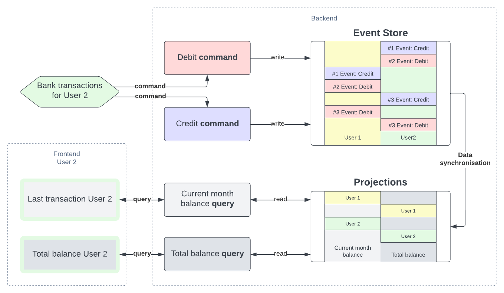

If you are user 2, you see that the application will fetch the total balance of your account from a read model that is called a **projection**. The entity that handles that action is called a query (cQrs). The projection of the balance is computed from the events stored in a database called the **event store**. A data synchronization system must be implemented to have accurate reading data compared to the source of truth. And when you make a transaction, a request is made to a **command** (Cqrs) that will write in the event store the event.

Now let's see how to implement it with AWS serverless technologies.

## Event Store

The source of truth of the application is the event store. All credit and debit events for every user are stored in it. We want a quick to access serverless database, therefore DynamoDB is the most appropriate. We have to define the access pattern to retrieve every events of a user in a chronological order. We can store the number of the event in a field named **version** and put it as `sort key` (SK). To easily retrieve data from a specific user we can use the **id of a user** as a `partition key` (PK). That way we have a composite primary key with the PK and the SK.

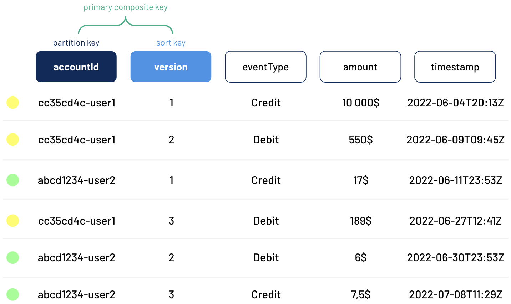

We start building our application. The event store represents its first block, and it contains credit and debit events of every user.

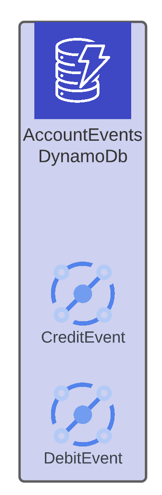

> :face_with_monocle: It is nice to be able to store data, but the question now is how do we store them?

## Command

We need to fuel this event store with some events. The command, which is the C of CQRS interface, is in charge of this. It's basically a handler that writes an event into the event store when triggered.

Building our architecture we want something to accept HTTP request, so an API Gateway HTTP does the job. Whenever you pay 20$ with your card, a POST request is made to the endpoint <code>account/{accountId}/<b>debit</b></code> with a body `{ amount: 20 }`. Then this triggers a lambda function dedicated to writing **debit events** in the event store, and in this case it writes the event `{ 'accountId': 'abcd1234-user2', 'version': 12, 'eventType': 'Debit', 'amount': 20, 'timestamp': '2022-07-25T20:13Z'}`. According to the same principle, **credit events** are written into the event store.

We now have our writing side with two routes, one for the debit transactions and one for credit transactions. Each route triggers a lambda that writes the event into the event store.

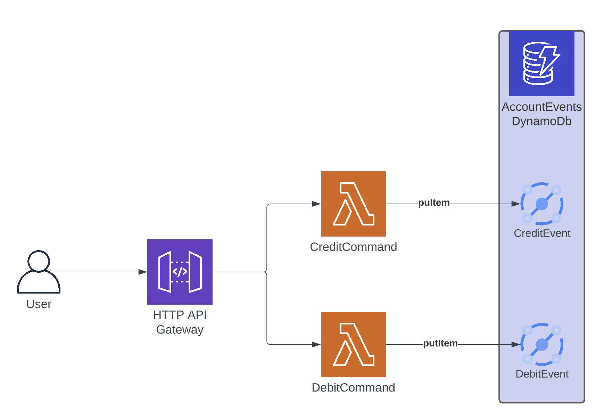

But we face an issue here. What happens if you want to buy blue jeans for 100$ but you only have 50$ and considering that we don't accept overdraft? We need **a way to know the current balance of your account** to implement some **business logic** to avoid unauthorized transactions. The computation of the current state of the account in question is called the aggregate.

## Aggregate

You need to remember that the source of truth of your application is the event store. Therefore when you want to make business verifications you have to do it on the event store and not on the projection which is only the read model.

Coming back to the purchase of your 100$ blue jeans, how do we know that you only have 50$ left and that you can't perform this debit transaction only based on former transactions. That's where we build a tool named aggregate to compute the current balance. Before creating an event in the command, we query on the partition key with your id and we get a sorted list of your events based on the version of each one. Then we simply replay every debit and credit event in a reducer and output the total balance of the account. Unfortunately the computation of the balance reveals that you can't afford these blue jeans and we are able to send an error back.

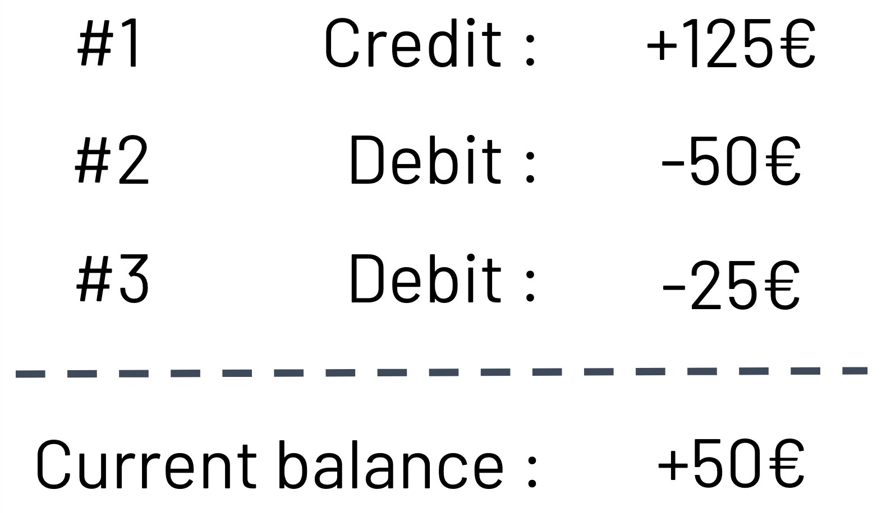

Likewise, we might need some business verification for the credit transaction. Thus our architecture should include a feedback loop between the command and the event store.

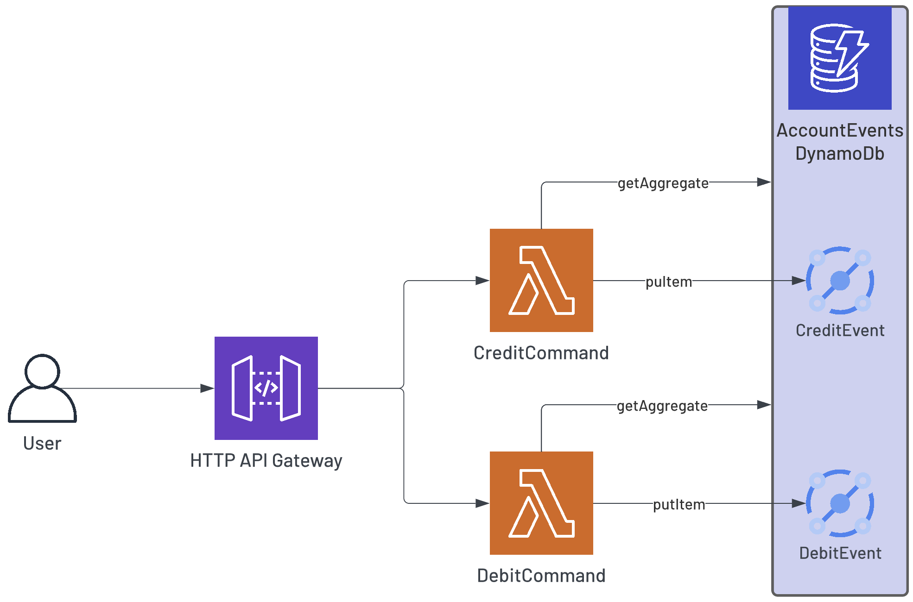

At this moment we are able to write consistent data in our source of truth. But we don't serve data from the event store directly. We will implement database for read models.

## Projection

First things first, where do we store our data? As banking application, the number of read actions is going to be substantial. Also as the number of clients increases we need to have automatic scalable resources to absorb the growing traffic without giving too much thoughts about it. For these reasons we are going to go also with DynamoDB to create the projections database.

Then how do we shape our data? The main purpose of CQRS is to split writing and reading data, so we can optimize the reading part by modeling correctly the models. In order to be as fast as possible, the read models projections can store data as it is viewed in the application, each projection representing a business entity. As the amount of storage is not the issue but the running time is, this is the most efficient way to store data event if it means duplicating some parts of read models data.

In our use case, we want to display the total balance of your account and the last transaction you made. For that purpose we will simply store these data for every user. We configure the id of the user as the partition key, that way every projection regarding the same user is stored in the same partition. We need to be able to fetch certain projection and filter others, so we put the type of projection as the sort key. The access pattern allow efficient access to displayable data.

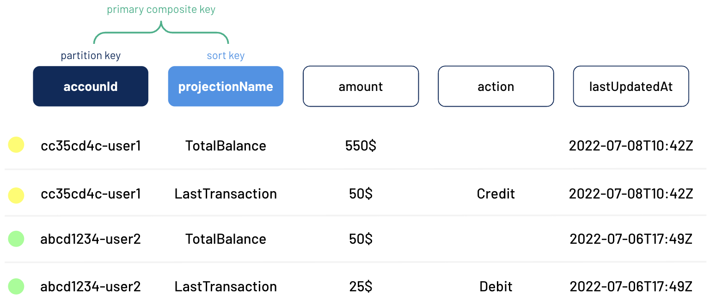

We can feed our architecture with a new block: the **projection**.

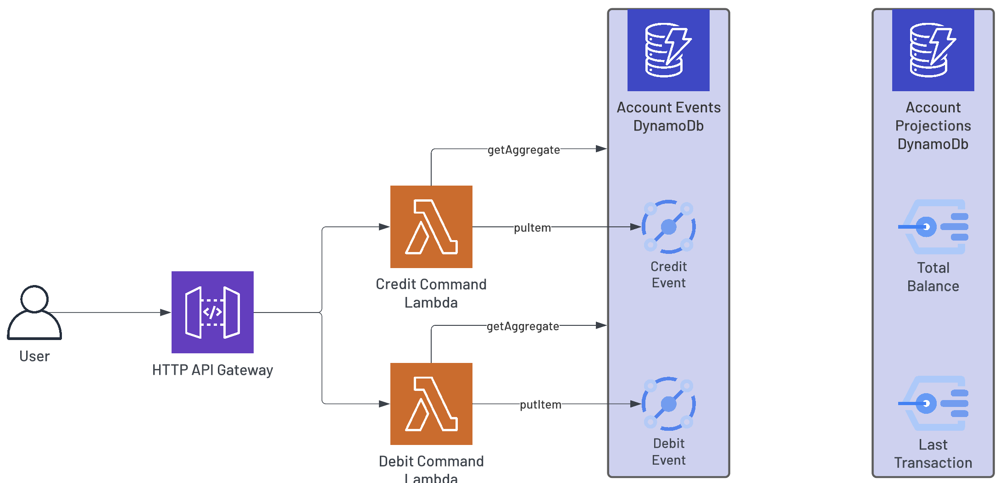

We know that we store read models as they are displayed in the frontend, so the question now is how do we retrieve that data?

## Query

Our application doesn't show anything for the moment because we don't fetch any data. It communicates via HTTP request to retrieve data. And we can query data from DynamoDB from a lambda function which rightly named Query, aka the Q in CQRS. Hence we can use the same type of interface as the command : an HTTP API Gateway combined with a lambda function that retrieves the correct data.

You go to your application to see the last transaction occurred into your account to be sure you emitted it. By navigating to the page where you can see it, a GET request is sent to the url <code>account/{accountId}/<b>last-transaction</b></code>. A lambda is then triggered, it queries the projection DynamoDB with the required parameters `{ 'accountId': 'abcd1234-user2, 'projectionName': 'LastTransaction' }`. It sends back the data synchronously to the frontend for it to display to you your last transaction recorded, and fortunately you are the emitter.

We have the two sides of the CQRS architecture, with the writing in the command and the reading in the query.

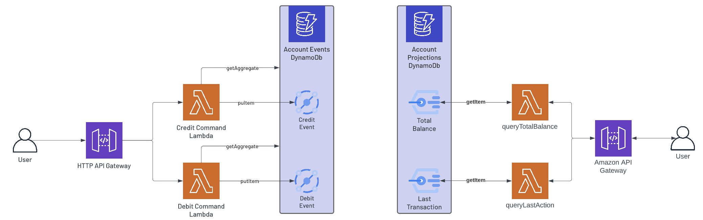

But there is a big part missing here. How do we transform data from events to projections? How is the synchronization between read and write models ensured?

## Data synchronization

The pain point in CQRS is to have reliable reading data compared to the source of truth. We need to find a way to compute and write projections according to events written in the event store.

### Projector

For the writing part, we have already done the job in the previous development. We will simply use lambda functions to put data in DynamoDB. These lambda are called projectors.

But where does the data come from? It's legitimate to think about Event Bridge events to carry data to trigger lambda. For example, the total balance projector can be triggered by a debit event of 20$ `{ 'eventType': 'Debit', 'amount': 20}`. The DynamoDB UpdateItem method allows us to manipulate the value of an existing record without querying it beforehand. In the case of a debit we can simply subtract 20 to the existing value of the projection. The same projector can listen to credit event also and update the projection the same way. We can think of updating the last transaction with an event carrying `{ 'eventType': 'Credit', 'amount': 40}` by overwriting the previous value of the projection.

We still don't know how are created these events carrying the data that is written in the event store.

### DynamoDB streams and fanout lambda

We want to react in real time to events written inside the event store. For that DynamoDb gives us a powerful tool that is called DynamoDB streams. We plug a lambda to the streams that will be triggered by every action made in the database. DynamoDB batches its streams of events in arrays, so we filter the `INSERT` actions and for each of them we publish an event in Amazon EventBridge.

> :question: You may wonder why not directly plug projector to the streams

For 3 reasons:

- A lambda that is plugged to the streams and that fails will retry indefinitely
- In every projector you would have to handle the filtering of events, and every projector would be triggered by every event
- You can only plug 2 lambda to the streams

> :warning: not sure of the exact reasons :warning:

This type of handler is called a fanout, it delivers events to one or multiple recipients. By doing so, each projector only needs to listen to event altering the data it's associated to. For example a projector writing user individual information such as the name family name and address doesn't need to be triggered by a credit event.

Our architecture seems now complete, from the emission of the event, to the writing of it, then the synchronization of the read models and eventually the reading of this new data.

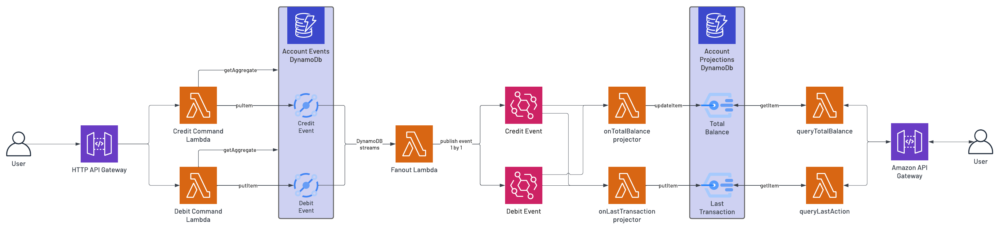

## Replay

This works fine in dev when you're not yet in production. But with this data synchronization architecture you will face bugs later on. Let me explain :

- When traffic is starting to grow, more and more events will flow and one thing EventBridge doesn't ensure is the order of the events sent in the bus event. You must keep the last version of the event that updated the projection not to overwrite a more recent information.
- EventBridge ensures that an event is sent at least once, but you can still receive it more than once. So you need to make your projections idempotent.
- In production, when you need to add a new projection, you must have a way to replay all events of a user to build the value of the projection. For example, you want to add the balance of the current month, when a new credit event comes in it seems unlikely that it's going to be the first event of the month. Then how do you know the actual value without replaying events?

> :star2: If you think about it, none of the above problems would be one if only we had access to the aggregate when updating a projection.

## Aggregate dispatcher

The aggregate represents the current state of your data at the version of the latest event taken into account. Furthermore, we can output any data we want from the history of event, especially the data we want to be accessible in our read models. If so, we would only have to update the projection with the corresponding part of the aggregate if its version is more recent than the version of the projection itself.

The replay would only require to trigger an event listened by all projector in order to update all projections at once.

We can think of implementing state carried events which means attaching the aggregate to the dispatched events. This would be instead of computing it every time a projector is triggered and giving them all access to the event store. We will build a Lambda function that takes only one event in argument, computes the aggregate and attaches it to the event before republishing it. That way, we leave the responsibility to the fanout to transform an array of streams to published EventBridge events, and we don't want it to fail during that task.

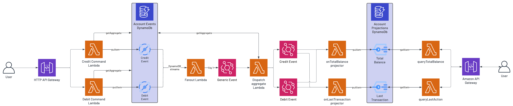

> :fire: And now you have it !

A prod-proof architecture implementing an event sourcing data storing pattern and managing it with a CQRS interface.

## Limits

- It requires a lot of setup, it may not be adequate for all type of application.
- If you don't intend to use the history of events as an actual data for your application but only for legal obligations, you could still log every event made in a database. That way you keep track of every actions a user performed but you don't have to worry about all this setup by simply implementing CRUD solution.
- Other than creating another database to logs these actions, you can activate DynamoDB versioning to keep track of all changes made on the table.

> Est-ce que je dois mettre plus de détails d'implémentation technique:
>
> - le type de méthode utilisée pour put ou get de la donnée dans dynamo
> - on utilise dynamodb toolbox
> - on type les events et on utilise typebridge
>
> Personnellement je trouve que ça peut faire vraiment beaucoup sachant que c'est déjà un gros article.
